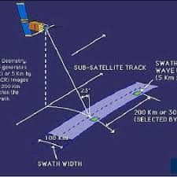

class: inverse, center, middle
#Introduction
##Synthetic Aperture Radar(SAR)
-A kind of Passive sensor

-An advanced remote sensing sensor technology that has revolutionized our ability to observe and understand the Earth's surface.SAR systems employ radar waves to capture high-resolution images and gather valuable information about the environment.
---
Class:inverse, left
#Fundamental Principle
.pull-left[**Synthetic Aperture Radar (SAR)** is to   utilize the phase differences in the radar beam to collect radar signals from various directions and positions, and then synthesize them to obtain high-resolution images. This technology allows SAR to generate surface images without being affected by the Earth's rotation, making it particularly useful for observations during nighttime, cloud cover, or different weather conditions.]

```{r echo=FALSE, out.width='40%', fig.align='right'}

```

---
class: inverse, middle,center
#Data Acquisition Process
1. **Transmission of Radar Signals**: The SAR system emits a microwave signal with a specific frequency and polarization.
  
1. **Interaction with the Ground**: The radar signal illuminates the Earth's surface,interacting with various surface features. Characteristics such as reflection, scattering, and absorption of the signal by surface objects influence the returned radar signal.
  
1. **Signal Reception and Recording**: The SAR system receives the reflected radar signals, capturing information about the phase and amplitude of the return echoes.
  
1. **Multiple Observations and Data Fusion**: SAR systems collect data from multiple observations of the same area, from different viewing angles and positions. These data are then combined and synthesized to produce high-resolution images.
---
class: inverse, middle, left
#Pros and Cons
.pull-left[
**Advantages**

1. All-Weather Observation

1. High Resolution

1. Penetration Capability

1. Long-Term Monitoring

1. Diverse Applications]
.pull-left[
**Disadvantages**

2. Complex Data Processing

2. Data Storage and Transmission
2. High Instrumentation Cost

2. Limited Frequency Resources]

---
class:inverse
#Applications of SAR
####Environmental Monitoring
SAR is used for tracking deforestation, soil moisture levels, changes in wetlands and coastal areas, and monitoring the effects of climate change.

####Agriculture
SAR helps in monitoring crop growth, estimating yields, and assessing soil moisture content, contributing to precision agriculture.
####Disaster Management
SAR plays a crucial role in disaster response by providing rapid and accurate assessments of affected areas after events like earthquakes, floods, and wildfires.
####Infrastructure Monitoring
It detects subsidence, structural deformation, and changes in urban areas, supporting infrastructure management.


---
class: inverse, center, middle
#Case Study
###"Reservoir monitoring and characterization using satellite geodetic data: Interferometric synthetic aperture radar observations from the Krechba field, Algeria"
###Author: D. W. Vasco, Alessandro Ferretti, and Fabrizio Novali
**Abstact**

  Application to interferometric synthetic-aperture radar (InSAR) data gathered over a carbon dioxide (CO2) injection site in Algeria reveals pressure propagation along two northwest-trending corridors. 


.footnote[case found from [Seg  Library](https://library-seg-org.libproxy.ucl.ac.uk/doi/epub/10.1190/1.2981184)]

---
#SAR Application
###How SAR Data is used?
In the research,  SAR data is collected using spaceborne radar sensors that emit signals towards the Earth and measure the reflections. This process allows for the detailed observation of the Earth's surface, including subtle deformations.

###How SAR Data is analysed?
The analysis of SAR data involves advanced techniques such as Interferometric Synthetic Aperture Radar (InSAR). InSAR utilizes the phase differences in the radar signals received over multiple passes to detect even slight changes in the Earth's surface, such as those caused by underground movements or reservoir changes. This method enables accurate monitoring of ground deformation, which is critical in understanding the dynamics of reservoirs and their impact on the surrounding environment.

---
#Summary
**Synthetic Aperture Radar (SAR)**
- Brief Introduction
- Fundamental Principle
- Data Acquisition Process
- Pros and Cons
- Application

**Future Use**  
In the future, SAR data will continue to play a significant role in various fields:
- **Advanced Analytics**: SAR data will be integrated with other datasets and analyzed using advanced machine learning and artificial intelligence techniques to extract more insights.
- **Spaceborne SAR**: Advances in SAR technology will likely lead to more sophisticated spaceborne SAR systems with higher resolution and improved data collection capabilities.
- **Environmental Sustainability**: SAR data will be crucial for monitoring and addressing environmental challenges, such as assessing the impact of rising sea levels, tracking deforestation, and managing water resources.
- **Urban Planning**: SAR will continue to support urban planners in managing and developing cities efficiently, especially in areas prone to subsidence and urban sprawl.


